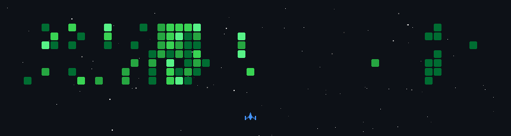

## 🌐 Socials

---

# 💻 Tech Stack

---

# 📊 GitHub Stats:
 
 
 

## 🏅 Achievements

## 📈 Contribution Activity

## 🏆 GitHub Trophies

### ✍️ Random Dev Quote

### 🔝 Top Contributed Repo

---

<!-- Proudly created with GPRM ( https://gprm.itsvg.in ) -->

## 🚀 My GitHub Activity Game

  

